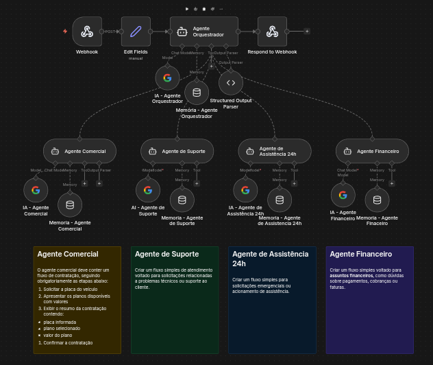
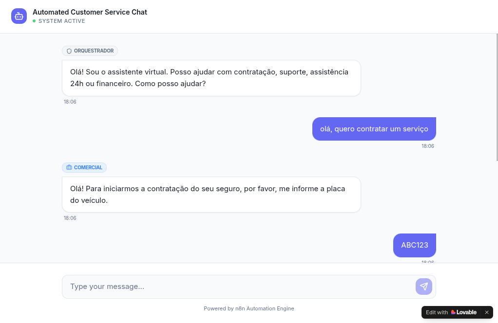

# 🤖 Sistema Multi-Agente de Atendimento Inteligente (n8n)



## 🌍 Acesso ao Sistema

> 🧪 **Acesse e interaja com o sistema:**
>
> ### 👉 https://arc-chat-assist.lovable.app/
>
> ⚙️ Teste o fluxo completo: envio → roteamento → resposta automatizada

## 📌 Visão Geral

Este projeto implementa um **sistema de atendimento automatizado com múltiplos agentes de IA**, construído no n8n utilizando a arquitetura LangChain. O sistema é capaz de compreender a intenção do usuário, rotear a conversa para o agente especialista correto e conduzir fluxos de negócio complexos de forma padronizada, como: vendas, suporte técnico, emergências e questões financeiras.

Diferente de chatbots tradicionais baseados em palavras-chave, este sistema utiliza **Modelos de Linguagem (LLMs)** para interpretar o contexto da conversa e agir de acordo com regras de negócio rigorosamente definidas em prompts.

## 🧠 Arquitetura do Sistema

O sistema é dividido em três camadas principais:

### 1. Camada de Entrada e Saída (Interface)
- **Lovable (Frontend de Chat)**: Interface responsável pela interação com o usuário, envio de mensagens e exibição das respostas do sistema em tempo real
- **Webhook**: Ponto de entrada para mensagens enviadas pelo frontend
- **Pré-processamento**: Padroniza os dados recebidos (`sessionId` e `message`)
- **Resposta Estruturada**: Todas as respostas seguem o formato JSON:
  ```json
  {
    "reply": "mensagem exibida ao usuário",
    "agent": "comercial | suporte | assistencia | financeiro | orquestrador"
  }
  ```

### 2. Camada de Roteamento (Orquestrador)
- **Agente Orquestrador**: Analisa a intenção da mensagem do usuário.
- **Modelo de IA (Gemini)**: Responsável pela interpretação da linguagem natural.
- **Memória de Curto Prazo**: Mantém o contexto das últimas 15 mensagens.
- **Parser de Saída Estruturada**: Garante que a resposta esteja sempre no formato JSON esperado.

### 3. Camada de Especialistas (Ferramentas)
Quatro agentes especialistas, cada um com:
- **Prompt de sistema detalhado**: Define regras de negócio, fluxo obrigatório e restrições.
- **Modelo de IA dedicado (Gemini)** : Garante isolamento de contexto.
- **Memória exclusiva**: Mantém o histórico da conversa com aquele agente.

| Agente | Responsabilidade |
|--------|------------------|
| **Comercial** | Vendas, cotações, planos e contratações |
| **Suporte** | Problemas técnicos, dificuldades de acesso, dúvidas de funcionamento |
| **Assistência 24h** | Emergências com veículo (pane, guincho, acidentes) |
| **Financeiro** | Faturas, boletos, pagamentos e cobranças |

## 💬 Interface de Chat (Lovable)



O sistema conta com uma interface de chat desenvolvida utilizando Lovable, responsável por permitir a interação do usuário com o fluxo automatizado.

### Funcionalidades:
- Envio de mensagens para o webhook do n8n
- Exibição das respostas retornadas pelo sistema
- Identificação do agente ativo na conversa
- Feedback visual de carregamento ("...")

### Fluxo de integração:
Lovable → Webhook (n8n) → Orquestrador → Agente → Resposta → Lovable

## ⚙️ Como Funciona na Prática

### Fluxo de Atendimento Padrão
```
Usuário → Webhook → Orquestrador → Agente Especialista → Resposta → Usuário
```

### Exemplo: Fluxo Comercial (Regras Rígidas)
O agente comercial segue **obrigatoriamente** estas 4 etapas:

1. **Solicitar a placa do veículo** (apenas se não informada)
2. **Apresentar os planos disponíveis**:
   - Plano Prata: R$ 85,00/mês (cobertura essencial)
   - Plano Ouro: R$ 135,00/mês (cobertura completa + guincho ilimitado)
3. **Exibir resumo da contratação**:
   ```
   Placa: [PLACA]
   Plano: [PLANO ESCOLHIDO]
   Mensalidade: [VALOR]
   ```
4. **Confirmar a contratação**

**Restrição crítica**: O agente NÃO pode solicitar nenhuma outra informação além da placa. Dados como nome, telefone, modelo do carro ou endereço devem ser ignorados.

### Exemplo: Assistência 24h
O agente de assistência deve:
1. Entender a situação emergencial
2. Coletar localização e tipo de problema
3. Registrar a solicitação
4. Encerrar informando que a equipe foi acionada

## 🛠️ Tecnologias Utilizadas

- **[n8n](https://n8n.io/)** : Plataforma de automação low-code
- **Google Gemini 2.5 flash (via API)**: Modelos de linguagem para todos os agentes
- **Webhooks**: Comunicação síncrona via HTTP
- **JSON**: Formato padronizado para troca de dados
- **Memória Buffer Window**: Contexto das últimas N mensagens por agente

## 📋 Pré-requisitos

- n8n instalado (self-hosted ou n8n.cloud)
- Chave de API do Google Gemini (ou outro LLM compatível)
- Ferramenta para testes de API (Postman, Insomnia, cURL)

## ▶️ Como Executar

### Passo 1: Importar o Workflow
1. Faça o download do arquivo [`atendimento-multi-agente.json`](./workflow/atendimento-multi-agente.json)
2. No n8n, crie um workflow, clique nos 3 pontos na parte superios direita da pagina e selecione **Import from File**
3. Selecione o arquivo baixado

### Passo 2: Configurar Credenciais
1. Abra qualquer nó de modelo de IA (ex: `IA - Agente Comercial`)
2. Em **Credential for Google Gemini**, selecione ou crie uma nova credencial com sua chave de API
3. Repita para todos os nós de IA (ou use a mesma credencial)

### Passo 3: Ativar o Webhook
1. Selecione o nó **Webhook**
2. Copie a URL gerada (formato: `https://[seu-n8n]/webhook/[id]`)
3. Ative o workflow (botão "Active")

### Passo 4: Testar
Envie requisições POST para a URL do webhook com o seguinte corpo:
```json
{
  "sessionId": "cliente-123",
  "message": "Quero contratar um plano para meu carro"
}
```

## 🧪 Casos de Teste Recomendados

| Intenção | Mensagem de Exemplo | Agente Esperado |
|----------|---------------------|------------------|
| **Comercial** | "Quero fazer um seguro para meu carro" | Comercial |
| **Comercial** | "Quanto custa o plano para a placa ABC1D23?" | Comercial |
| **Suporte** | "Não consigo acessar minha conta" | Suporte |
| **Assistência** | "Preciso de um guincho, meu carro enguiçou" | Assistência 24h |
| **Financeiro** | "Quero a segunda via do meu boleto" | Financeiro |
| **Ambíguo** | "Preciso de ajuda" | Orquestrador (pede esclarecimento) |
